**约束布局ConstraintLayout**

* 介绍
* 为什么要用ConstraintLayout
* 如何使用ConstraintLayout
	* 添加依赖
	* 相对定位
	* 角度定位
	* 边距
	* 居中和偏移
	* 尺寸约束
	* 链
* 辅助工具
	* Optimizer
	* Barrier
	* Group
	* Placeholder
	* Guideline
* 总结

**1. 介绍**

约束布局ConstraintLayout 是一个ViewGroup，可以在Api9以上的Android系统使用它，它的出现主要是为了解决布局嵌套过多的问题，以灵活的方式定位和调整小部件。从 Android Studio 2.3 起，官方的模板默认使用 [ConstraintLayout](https://developer.android.google.cn/reference/android/support/constraint/ConstraintLayout)。

**2.为什么要用ConstraintLayout**

* 在开发过程中经常能遇到一些复杂的UI，可能会出现布局嵌套过多的问题，嵌套得越多，设备绘制视图所需的时间和计算功耗也就越多
* 有些人考虑到了嵌套布局带来的风险，所以用一个RelativeLayout来装下所有的控件。那么问题来了，既然用RelativeLayout可以解决问题，为什么还要使用ConstraintLayout呢？因为ConstraintLayout使用起来比RelativeLayout更灵活，性能更出色！
* 还有一点就是ConstraintLayout可以按照比例约束控件位置和尺寸，能够更好地适配屏幕大小不同的机型。

**3.如何使用ConstraintLayout**

**3.1添加依赖**

首先我们需要在app/build.gradle文件中添加ConstraintLayout的依赖，如下所示。

 	implementation 'com.android.support.constraint:constraint-layout:1.1.0'
 	
 **3.2相对定位**
 
 例如：
 
	 <TextView
	        android:id="@+id/tv1"
	        ...
	        android:text="tv1" />
	
    <TextView
        android:id="@+id/tv2"
        ...
        app:layout_constraintLeft_toRightOf="@+id/tv1" />
	
    <TextView
        android:id="@+id/tv3"
        ...
        app:layout_constraintTop_toBottomOf="@+id/tv2" />
 	
上面代码中在Tv2里用到了app:layout_constraintLeft_toRightOf="@+id/tv1"这个属性，他的意思是把Tv2的左边约束到Tv1的右边

下面来看看相对定位的常用属性：

	layout_constraintLeft_toLeftOf
	layout_constraintLeft_toRightOf
	layout_constraintRight_toLeftOf
	layout_constraintRight_toRightOf
	layout_constraintTop_toTopOf
	layout_constraintTop_toBottomOf
	layout_constraintBottom_toTopOf
	layout_constraintBottom_toBottomOf
	layout_constraintBaseline_toBaselineOf
	layout_constraintStart_toEndOf
	layout_constraintStart_toStartOf
	layout_constraintEnd_toStartOf
	layout_constraintEnd_toEndOf

上面属性中有一个比较有趣的layout_constraintBaseline_toBaselineOf
Baseline指的是文本基线，

* 举个例子：两个TextView的高度不一致，但是又希望他们文本对齐，

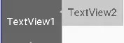

这个时候就可以使用layout_constraintBaseline_toBaselineOf，代码如下：

		<TextView
		        android:id="@+id/tv1"
		        .../>
	    <TextView
	        android:id="@+id/tv2"
	        ...
	        app:layout_constraintLeft_toRightOf="@+id/tv1" 
	        app:layout_constraintBaseline_toBaselineOf="@+id/tv1"/>

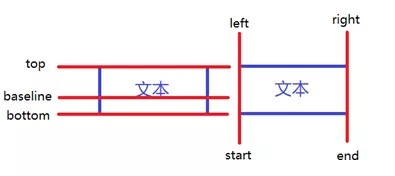

**3.3 角度定位**

角度定位指的是可以用一个角度和一个距离来约束两个空间的中心。举个例子：

	<TextView
	    android:id="@+id/TextView1"
	    android:layout_width="wrap_content"
	    android:layout_height="wrap_content" />
	
	<TextView
	    android:id="@+id/TextView2"
	    android:layout_width="wrap_content"
	    android:layout_height="wrap_content"
	    app:layout_constraintCircle="@+id/TextView1"
	    app:layout_constraintCircleAngle="120"
	    app:layout_constraintCircleRadius="150dp" />
	    
上面例子中的TextView2用到了3个属性：

* app:layout_constraintCircle="@+id/TextView1"
* app:layout_constraintCircleAngle="120"（角度）
* app:layout_constraintCircleRadius="150dp"（距离）

指的是TextView2的中心在TextView1的中心的120度，距离为150dp，效果如下：

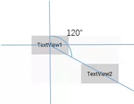

**3.4 边距**

ConstraintLayout的边距常用属性如下：

	android:layout_marginStart
	android:layout_marginEnd
	android:layout_marginLeft
	android:layout_marginTop
	android:layout_marginRight
	android:layout_marginBottom

看起来跟别的布局没有什么差别，但实际上控件在ConstraintLayout里面要实现margin，必须先约束该控件在ConstraintLayout里的位置，举个例子：

	<android.support.constraint.ConstraintLayout 
	android:layout_width="match_parent"
	android:layout_height="match_parent">
	
	<TextView
	    android:id="@+id/TextView1"
	    android:layout_width="wrap_content"
	    android:layout_height="wrap_content"
	    android:layout_marginLeft="10dp"
	    android:layout_marginTop="10dp" />
	
	</android.support.constraint.ConstraintLayout>
	
如果在别的布局里，TextView1的位置应该是距离边框的左边和上面有一个10dp的边距，但是在ConstraintLayout里，是不生效的，因为没有约束TextView1在布局里的位置。正确的写法如下：

	<android.support.constraint.ConstraintLayout 
	    android:layout_width="match_parent"
	    android:layout_height="match_parent">
	
	    <TextView
	        android:id="@+id/TextView1"
	        android:layout_width="wrap_content"
	        android:layout_height="wrap_content"
	        android:layout_marginLeft="10dp"
	        android:layout_marginTop="10dp" 
	        app:layout_constraintLeft_toLeftOf="parent"
	        app:layout_constraintTop_toTopOf="parent"/>
	
	</android.support.constraint.ConstraintLayout>
	
把TextView1的左边和上边约束到parent的左边和上边，这样margin就会生效，效果如下：

在使用margin的时候要注意两点：

* 控件必须在布局里约束一个相对位置
* margin只能大于等于0

goneMargin主要用于约束的控件可见性被设置为gone的时候使用的margin值，属性如下：
	
	layout_goneMarginStart
	layout_goneMarginEnd
	layout_goneMarginLeft
	layout_goneMarginTop
	layout_goneMarginRight
	layout_goneMarginBottom

举个例子：
假设TextView2的左边约束在TextView1的右边，并给TextView2设一个app:layout_goneMarginLeft="10dp"，代码如下：
	
	<android.support.constraint.ConstraintLayout 
	    android:layout_width="match_parent"
	    android:layout_height="match_parent">
	
	    <TextView
	        android:id="@+id/TextView1"
	        .../>
	
	    <TextView
	        android:id="@+id/TextView2"
	        ...
	        app:layout_constraintLeft_toRightOf="@+id/TextView1"
	        app:layout_goneMarginLeft="10dp"
	        />
	
	</android.support.constraint.ConstraintLayout>
	
效果如下，TextView2在TextView1的右边，且没有边距。

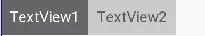

这个时候把TextView1的可见性设为gone，效果如下：

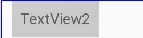

TextView1消失后，TextView2有一个距离左边10dp的边距。

**3.5 居中和偏移**

在RelativeLayout中，把控件放在布局中间的方法是把layout_centerInParent设为true，而在ConstraintLayout中的写法是：
	
	app:layout_constraintBottom_toBottomOf="parent"
	app:layout_constraintLeft_toLeftOf="parent"
	app:layout_constraintRight_toRightOf="parent"
	app:layout_constraintTop_toTopOf="parent"
	
意思是把控件的上下左右约束在布局的上下左右，这样就能把控件放在布局的中间了。同理RelativeLayout中的水平居中layout_centerHorizontal相当于在ConstraintLayout约束控件的左右为parent的左右；RelativeLayout中的垂直居中layout_centerVertical相当于在ConstraintLayout约束控件的上下为parent的上下。
由于ConstraintLayout中的居中已经为控件约束了一个相对位置，所以可以使用margin，如下所示：

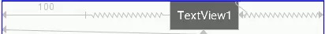

上面TextView1在水平居中后使用layout_marginLeft="100dp"向右偏移了100dp。除了这种偏移外，ConstraintLayout还提供了另外一种偏移的属性：

* layout_constraintHorizontal_bias 水平偏移
* layout_constraintVertical_bias 垂直偏移

举个例子：

	<TextView
	    android:id="@+id/TextView1"
	    ...
	    app:layout_constraintHorizontal_bias="0.3"
	    app:layout_constraintLeft_toLeftOf="parent"
	    app:layout_constraintRight_toRightOf="parent" />
	    
效果如下：

假如现在要实现水平偏移，给TextView1的layout_constraintHorizontal_bias赋一个范围为 0-1 的值，假如赋值为0，则TextView1在布局的最左侧，假如赋值为1，则TextView1在布局的最右侧，假如假如赋值为0.5，则水平居中，假如假如赋值为0.3，则更倾向于左侧。
垂直偏移同理。

**3.6 尺寸约束**

控件的尺寸可以通过四种不同方式指定：

* 使用指定的尺寸

* 使用wrap_content，让控件自己计算大小
当控件的高度或宽度为wrap_content时，可以使用下列属性来控制最大、最小的高度或宽度：
	
		android:minWidth 最小的宽度
		android:minHeight 最小的高度
		android:maxWidth 最大的宽度
		android:maxHeight 最大的高度
	
	注意！当ConstraintLayout为1.1版本以下时，使用这些属性需要加上强制约束，如下所示：
		
		app:constrainedWidth=”true”
		app:constrainedHeight=”true”

* 使用 0dp (MATCH_CONSTRAINT)
官方不推荐在ConstraintLayout中使用match_parent，可以设置 0dp (MATCH_CONSTRAINT) 配合约束代替match_parent，举个例子：

		<TextView
		    android:id="@+id/TextView1"
		    android:layout_width="0dp"
		    android:layout_height="wrap_content"
		    android:layout_marginLeft="50dp"
		    app:layout_constraintLeft_toLeftOf="parent"
		    app:layout_constraintRight_toRightOf="parent"
		    android:visibility="visible" />
		    
宽度设为0dp，左右两边约束parent的左右两边，并设置左边边距为50dp，效果如下：

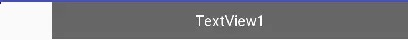

* 宽高比

	当宽或高至少有一个尺寸被设置为0dp时，可以通过属性layout_constraintDimensionRatio设置宽高比，举个例子：
	
		<TextView
		        android:id="@+id/TextView1"
		        android:layout_width="0dp"
		        android:layout_height="wrap_content"
		        app:layout_constraintDimensionRatio="1:1"
		        app:layout_constraintLeft_toLeftOf="parent"
		        app:layout_constraintRight_toRightOf="parent" />

	宽设置为0dp，宽高比设置为1:1，这个时候TextView1是一个正方形，效果如下：

	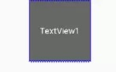

	除此之外，在设置宽高比的值的时候，还可以在前面加W或H，分别指定宽度或高度限制。 例如：
	
		app:layout_constraintDimensionRatio="H,2:3"指的是 高:宽=2:3
		app:layout_constraintDimensionRatio="W,2:3"指的是 宽:高=2:3
		
**3.7 链**

如果两个或以上控件通过下图的方式约束在一起，就可以认为是他们是一条链（图为横向的链，纵向同理）。

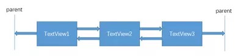

用代码表示：

	<TextView
	    android:id="@+id/TextView1"
	    android:layout_width="wrap_content"
	    android:layout_height="wrap_content"
	    app:layout_constraintLeft_toLeftOf="parent"
	    app:layout_constraintRight_toLeftOf="@+id/TextView2" />
	
	<TextView
	    android:id="@+id/TextView2"
	    android:layout_width="wrap_content"
	    android:layout_height="wrap_content"
	    app:layout_constraintLeft_toRightOf="@+id/TextView1"
	    app:layout_constraintRight_toLeftOf="@+id/TextView3"
	    app:layout_constraintRight_toRightOf="parent" />
	
	<TextView
	    android:id="@+id/TextView3"
	    android:layout_width="wrap_content"
	    android:layout_height="wrap_content"
	    app:layout_constraintLeft_toRightOf="@+id/TextView2"
	    app:layout_constraintRight_toRightOf="parent" />
	    
3个TextView相互约束，两端两个TextView分别与parent约束，成为一条链，效果如下：

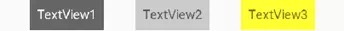

一条链的第一个控件是这条链的链头，我们可以在链头中设置 

layout_constraintHorizontal_chainStyle来改变整条链的样式。

chains提供了3种样式，分别是：

* CHAIN_SPREAD —— 展开元素 (默认)；
* CHAIN_SPREAD_INSIDE —— 展开元素，但链的两端贴近parent；
* CHAIN_PACKED —— 链的元素将被打包在一起。

如图所示：

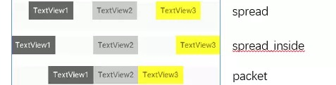

上面的例子创建了一个样式链，除了样式链外，还可以创建一个权重链。
可以留意到上面所用到的3个TextView宽度都为wrap_content，如果我们把宽度都设为0dp，这个时候可以在每个TextView中设置横向权重layout_constraintHorizontal_weight(constraintVertical为纵向)来创建一个权重链，如下所示：

	<TextView
	    android:id="@+id/TextView1"
	    android:layout_width="0dp"
	    android:layout_height="wrap_content"
	    app:layout_constraintLeft_toLeftOf="parent"
	    app:layout_constraintRight_toLeftOf="@+id/TextView2"
	    app:layout_constraintHorizontal_weight="2" />
	
	<TextView
	    android:id="@+id/TextView2"
	    android:layout_width="0dp"
	    android:layout_height="wrap_content"
	    app:layout_constraintLeft_toRightOf="@+id/TextView1"
	    app:layout_constraintRight_toLeftOf="@+id/TextView3"
	    app:layout_constraintRight_toRightOf="parent"
	    app:layout_constraintHorizontal_weight="3" />
	
	<TextView
	    android:id="@+id/TextView3"
	    android:layout_width="0dp"
	    android:layout_height="wrap_content"
	    app:layout_constraintLeft_toRightOf="@+id/TextView2"
	    app:layout_constraintRight_toRightOf="parent"
	    app:layout_constraintHorizontal_weight="4" />

效果如下：

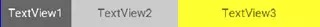

**4.辅助工具**

**4.1 Optimizer**

当我们使用 MATCH_CONSTRAINT 时，ConstraintLayout 将对控件进行 2 次测量，ConstraintLayout在1.1中可以通过设置 layout_optimizationLevel 进行优化，可设置的值有：

* none：无优化
* standard：仅优化直接约束和屏障约束（默认）
* direct：优化直接约束
* barrier：优化屏障约束
* chain：优化链约束
* dimensions：优化尺寸测量

**4.2 Barrier**

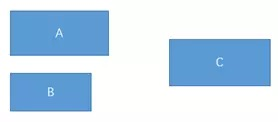

假设有3个控件ABC，C在AB的右边，但是AB的宽是不固定的，这个时候C无论约束在A的右边或者B的右边都不对。当出现这种情况可以用Barrier来解决。Barrier可以在多个控件的一侧建立一个屏障，如下所示：

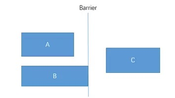

这个时候C只要约束在Barrier的右边就可以了，代码如下：

	<TextView
	    android:id="@+id/TextView1"
	    android:layout_width="wrap_content"
	    android:layout_height="wrap_content" />
	
	<TextView
	    android:id="@+id/TextView2"
	    android:layout_width="wrap_content"
	    android:layout_height="wrap_content"
	    app:layout_constraintTop_toBottomOf="@+id/TextView1" />
	
	<android.support.constraint.Barrier
	    android:id="@+id/barrier"
	    android:layout_width="wrap_content"
	    android:layout_height="wrap_content"
	    app:barrierDirection="right"
	    app:constraint_referenced_ids="TextView1,TextView2" />
	
	<TextView
	    android:id="@+id/TextView3"
	    android:layout_width="wrap_content"
	    android:layout_height="wrap_content"
	    app:layout_constraintLeft_toRightOf="@+id/barrier" />
	   
* app:barrierDirection为屏障所在的位置，可设置的值有：bottom、end、left、right、start、top
* app:constraint_referenced_ids为屏障引用的控件，可设置多个(用“,”隔开)

**4.3 Group**

Group可以把多个控件归为一组，方便隐藏或显示一组控件，举个例子：

	<TextView
	    android:id="@+id/TextView1"
	    android:layout_width="wrap_content"
	    android:layout_height="wrap_content" />
	
	<TextView
	    android:id="@+id/TextView2"
	    android:layout_width="wrap_content"
	    android:layout_height="wrap_content"
	    app:layout_constraintLeft_toRightOf="@+id/TextView1" />
	
	<TextView
	    android:id="@+id/TextView3"
	    android:layout_width="wrap_content"
	    android:layout_height="wrap_content"
	    app:layout_constraintLeft_toRightOf="@id/TextView2" />
	    
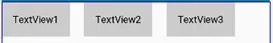

现在有3个并排的TextView，用Group把TextView1和TextView3归为一组，再设置这组控件的可见性，如下所示：

	<android.support.constraint.Group
	    android:id="@+id/group"
	    android:layout_width="wrap_content"
	    android:layout_height="wrap_content"
	    android:visibility="invisible"
	    app:constraint_referenced_ids="TextView1,TextView3" />
	    
效果如下：

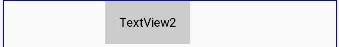

**4.4 Placeholder**

Placeholder指的是占位符。在Placeholder中可使用setContent()设置另一个控件的id，使这个控件移动到占位符的位置。举个例子：

	<android.support.constraint.Placeholder
	    android:id="@+id/placeholder"
	    android:layout_width="wrap_content"
	    android:layout_height="wrap_content"
	    app:content="@+id/textview"
	    app:layout_constraintLeft_toLeftOf="parent"
	    app:layout_constraintTop_toTopOf="parent" />
	
	<TextView
	    android:id="@+id/textview"
	    android:layout_width="wrap_content"
	    android:layout_height="wrap_content"
	    android:background="#cccccc"
	    android:padding="16dp"
	    android:text="TextView"
	    android:textColor="#000000"
	    app:layout_constraintRight_toRightOf="parent"
	    app:layout_constraintTop_toTopOf="parent" />
	    
新建一个Placeholder约束在屏幕的左上角，新建一个TextView约束在屏幕的右上角，在Placeholder中设置 app:content="@+id/textview"，这时TextView会跑到屏幕的左上角。效果如下：

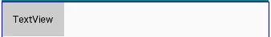

**4.5 Guideline**

Guildline像辅助线一样，在预览的时候帮助你完成布局（不会显示在界面上）。
Guildline的主要属性：

* android:orientation 垂直vertical，水平horizontal
* layout_constraintGuide_begin 开始位置
* layout_constraintGuide_end 结束位置
* layout_constraintGuide_percent 距离顶部的百分比(orientation = horizontal时则为距离左边)

举个例子：

	<android.support.constraint.Guideline
	    android:id="@+id/guideline1"
	    android:layout_width="wrap_content"
	    android:layout_height="wrap_content"
	    android:orientation="horizontal"
	    app:layout_constraintGuide_begin="50dp" />
	
	<android.support.constraint.Guideline
	    android:id="@+id/guideline2"
	    android:layout_width="wrap_content"
	    android:layout_height="wrap_content"
	    android:orientation="vertical"
	    app:layout_constraintGuide_percent="0.5" />
	    
guideline1为水平辅助线，开始位置是距离顶部50dp，guideline2位垂直辅助线，开始位置为屏幕宽的0.5(中点位置)，效果如下：

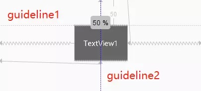

**5.总结**

本篇文章主要介绍了ConstraintLayout和它在布局文件里的用法，和一些辅助ConstraintLayout布局的工具，跟着敲一遍就能学会ConstraintLayout。除此之外，ConstraintLayout还有一个独立的编辑器，只需要托拉拽就可以完成整个布局,有兴趣的可以[参考](https://blog.csdn.net/guolin_blog/article/details/53122387)

[原文链接](https://www.jianshu.com/p/17ec9bd6ca8a)
来源：简书

